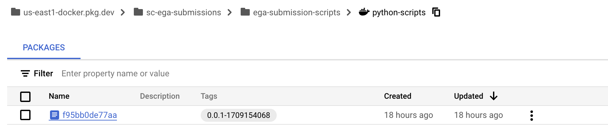
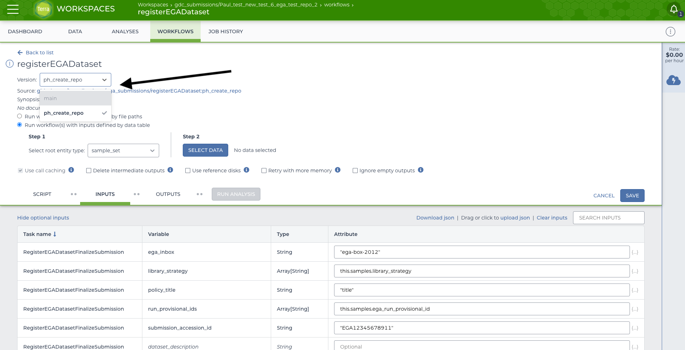

# EGA Submissions

## Overview
The EGA Submissions repository serves as a comprehensive solution for orchestrating submissions to the [European Genome-Phenome Archive](https://ega-archive.org/) (EGA). It encompasses three distinct [Workflow Description Language](https://openwdl.org/) (WDL) scripts, each responsible for a crucial step in the submission process:

1. **[File Transfer WDL](workflows/EGAFileTransfer/EGAFileTransfer.wdl)**: 
   - This script is designed for submitting data files to the EGA. It manages the efficient and secure transfer of genomic data to the archive, ensuring a seamless submission process.

2. **[Experiment and Run Registration WDL](workflows/RegisterEGAExperimentAndRun/RegisterEGAExperimentAndRun.wdl)**: 
   - Responsible for registering the experiment and run details associated with the submitted data. This step ensures accurate tracking and metadata association, enhancing the organization of genomic information within the EGA.

3. **[Dataset Finalization WDL](workflows/RegisterEGADatasetFinalizeSubmission/RegisterEGADatasetFinalizeSubmission.wdl)**: 
   - This script handles the finalization of datasets, ensuring completeness and integrity. It encompasses any necessary post-submission steps, providing a comprehensive end-to-end solution for EGA submissions.

The workflow execution follows a sequential order:

- **Step 1: File Transfer**
  - Initiates the secure transfer of genomic data files to the EGA.

- **Step 2: Experiment and Run Registration**
  - Registers essential metadata related to the experiment and run, facilitating proper organization within the EGA.

- **Step 3: Dataset Finalization**
  - Completes the submission process by finalizing datasets and performing any post-submission tasks.

This repository equips users with the necessary tools and resources to streamline the submission of genomic data to the EGA, ensuring a well-organized and efficient workflow from file transfer to dataset finalization.

## Features
- **[Workflows](workflows):** This directory will house all the WDLs responsible for Sample submission. (e.g., [EGAFileTransfer.wdl](workflows/EGAFileTransfer/EGAFileTransfer.wdl), [RegisterEGAExperimentAndRun.wdl](workflows/RegisterEGAExperimentAndRun/RegisterEGAExperimentAndRun.wdl), and [EGADatasetFinalizeSubmission.wdl](workflows/RegisterEGADatasetFinalizeSubmission/RegisterEGADatasetFinalizeSubmission.wdl)).
- **[Scripts](scripts):** This directory contains all the Python code responsible for the delivery of samples and registering metadata using the [EGA APIs](https://submission.ega-archive.org/api/spec/#/).

## Making Changes
Deploying any changes to this repository has two different methods based on where the changes are made.
In order to push changes to the Python code to GCR, you'll need the `gcloud` CLI (Command Line Interface) installed. See directions [here](https://cloud.google.com/sdk/docs/install).

### Script Updates
All Python code is contained in a Docker image, which is stored in Google Container Registry. The Terra workflows then pull these Docker images in the WDLs.
With every change to the Python code, you will need to rebuild and push the Docker image. You will need write access to the Container Registry in the `sc-ega-submissions` project. Reach out to Sam Bryant if you need these permissions.
To rebuild and push the Docker images, run the [docker_build.sh](docker_build.sh) script from the root of the repository: 
```commandline
./docker_build.sh
```

If you're not already logged in via gcloud, you will have to run `gcloud auth login` first and login via your Broad account. See directions [here](https://cloud.google.com/sdk/docs/install) for installing the gcloud CLI. See directions [here](https://cloud.google.com/docs/authentication/gcloud) for authenticating with gcloud. 

Sometimes, it is helpful to view the contents of the Docker image. To do this, we can simply SSH into the image:
```bash
docker pull gcr.io/gdc-submissions/ega-submission-scripts:1.0.0
docker run -it gcr.io/gdc-submissions/ega-submission-scripts:1.0.0
```

Once you've built and pushed your Docker image, you'll have to find the Docker tag and update all the WDL workflows to use the new tag. You'll see the new Docker tag in the output of the console when you build the image. 
Alternatively, you can navigate to GCR via the Google console [here](https://console.cloud.google.com/artifacts?authuser=0&project=sc-ega-submissions). Select the image name (in this case `ega-submission-scripts`), select `python-scripts`, and copy the latest tag. See screenshot below. In this example, the tag you'll want to copy is `0.0.1-1709154068`.

---


---

Once you have the new tag, update the tag in ALL the WDL files where there is a docker image in the runtime attributes. The part you'll want to replace is everything after the `:`. 
An example of a runtime attribute that would need to be changed is [here](https://github.com/broadinstitute/ega_submissions/blob/267576b44a21f5f390f9ab3fc823af28e038f97a/workflows/EGAFileTransfer/EGAFileTransfer.wdl#L37-L42).

So for example, this old tag would get changed in the following manner to the new tag:
```
OLD: us-east1-docker.pkg.dev/sc-ega-submissions/ega-submission-scripts/python-scripts:0.0.1-1708546220
NEW: us-east1-docker.pkg.dev/sc-ega-submissions/ega-submission-scripts/python-scripts:0.0.1-1709154068
```
Once you've made this change, push the changes to the GitHub repository. See [Workflow Updates](#workflow-updates) for how to implement changes in WDL files.

### Workflow Updates
Making any changes inside the workflows directory (i.e. to any WDL files) is straightforward. Simply push your changes to the GitHub repository. Since we are using GitHub Apps, these changes will be automatically loaded into Terra. If you'd like to test a feature branch, select your feature branch when running the workflow in Terra (see screenshot below). Alternatively, if you've merged your changes into `main`, ensure that `main` is selected as the branch (this should be the default branch).

---


---


## Running an EGA Submission end-to-end
### One-time pre-requisites
1. Register your [EGA account](https://ega-archive.org/register/) and receive credentials (i.e. a username/inbox and password combination)
2. Submit [a request](https://profile.ega-archive.org/submitter-request) to receive a "Submitter" role status
3. Ensure your Broad email is added as a member to the `SC-EGA-SUBMISSIONS` Terra group (the group email is `SC-EGA-SUBMISSIONS@firecloud.org`). Reach out to Sam Bryant to be added to this group.

### One-time set up for each new Submission 
1. Create an initial "parent" Submission (once your request for the "Submitter" role is approved, you'll see an option in the [Submitter portal](https://submission.ega-archive.org/) to "Create a Submission")
2. Submit at least one Study (see detailed instructions [here](https://ega-archive.org/submission/metadata/submission/sequencing-phenotype/submitter-portal/))
3. Upload a cohort of Samples 
4. Register your DAC/Policy 
5. Fill out [this form](https://data-operations-portal.gotc-prod.broadinstitute.org/jira/ega_sample_submission/), including the same samples from your Study in the tsv which you upload to the form. Filling out this form will create a new Terra workspace, import all the necessary metadata into the data tables, and import all necessary workflows. All workflows will be pre-configured with inputs, there will be little that needs to changed manually. 

### Running your Terra workflows
1. Once the ticket generated by the form is auto-resolved, this will indicate that your workspace is ready to go. 
2. Open your Terra workspace and navigate to the "Workflows" tab. 
3. The first workflow to be run is the `egaFileTransfer` workflow, which will encrypt and upload your bam/cram files to the EGA. 
   * All workflow inputs and outputs are pre-configured here, and nothing has to be changed. 
   * Ensure that `Run workflow(s) with inputs defined by data table` is selected
   * Ensure that the root entity type selected is `sample`
   * **Ensure that `Use call caching` is UNSELECTED**
   * Ensure that `Delete intermediate outputs` is selected 
   * Now click `SELECT DATA` and from the little arrow at the top left box, select `All` and click `OK` then `RUN ANALYSIS` to submit your run(s). 
   * This workflow runs at the sample-level (i.e. if you have 100 samples in your workspace, 100 analysis will be submitted). 
   * Though encrypting and uploading the files does not take very long, the EGA validation of files may take a while. It's best to submit this workflow, ensure it finishes and wait at least a day before moving on to the next workflow.
4. The second workflow to be run is the `registerEGAExperimentAndRuns` workflow, which will register an experiment and run for each sample in the EGA submission. Only run this workflow once all samples have run to successful completion in the previous step. _**Note that this workflow will not complete unless the file has been validated on EGA's end. If the file has been validated, the metadata in the workspace will be updated to indicate its valid status and the workflow will continue (you'll see `validated` show up under the `file_validation_status` column in the workspace metadata). If not, the workflow will exit.**_ If a file has not been validated, you will have to wait and resubmit at a later date since we have no control over how long it takes for EGA to validate a file.
   * All workflow inputs and outputs are pre-configured here. The only parameter that you might want to change is the `delete_files` parameter. This is by default set to false, but setting it to true will delete the bam/cram after the file has been validated and the experiment/run have been registered in the EGA.
   * Ensure that `Run workflow(s) with inputs defined by data table` is selected
   * Ensure that the root entity type selected is `sample`
   * **Ensure that `Use call caching` is UNSELECTED**
   * Ensure that `Delete intermediate outputs` is selected 
   * Now click `SELECT DATA` and from the little arrow at the top left box, select `All` and click `OK` then `RUN ANALYSIS` to submit your run(s).
   * This workflow runs at the sample-level (i.e. if you have 100 samples in your workspace, 100 analysis will be submitted).
5. The third and last workflow to be run is the `registerEGADataset`. Only run this workflow once all samples have run to successful completion in the previous step.
    * All workflow inputs and outputs are pre-configured here, and nothing has to be changed. 
    * Ensure that `Run workflow(s) with inputs defined by data table` is selected
    * Ensure that the root entity type selected is `sample_set`
    * **Ensure that `Use call caching` is UNSELECTED**
    * Ensure that `Delete intermediate outputs` is selected 
    * Now click `SELECT DATA` and chose your sample set that includes ALL of your samples (i.e. if you have 100 samples, select the sample set that indicates that it includes 100 entities). Select `OK`, then `RUN ANALYSIS` to submit your _run_ (should only be 1 in this case!). 
    * This workflow runs at the sample set-level (i.e. even if you have 100 samples in your workspace, only 1 analysis should be submitted).
6. Once all 3 workflows have run to completion, your submission is finalized! You'll be able to view it in the Submitter Portal in the EGA. All metadata can be changed via the UI if desired.

## EGA Passwords and Storage 
### Naming Convention
All EGA passwords are now stored in Google's Secret Manager in the `sc-ega-submissions` Google project. By default, our Python code looks in Secret Manager for a secret that's stored using a specific naming convention. The naming convention we follow for the password is `{ega_inbox}_password`. So for example, if your EGA inbox (or "username") is `ega-box-123`, our Python code looks for a secret stored with the name `ega-box-123_password`.
In order for our scripts to work, the corresponding password for the `ega-box-123` account should be stored in Secret Manger under the name `ega-box-123_password`. 

### Adding a new Password 
If you have a new account that needs a new password stored, you'll first need permissions to add new Google secrets. Reach out to Sam Bryant to obtain these permissions.  
Once you have correct permissions, you can navigate to the `sc-ega-submission` [Secret Manager](https://console.cloud.google.com/security/secret-manager?referrer=search&authuser=0&project=sc-ega-submissions) console page, click "Create Secret" at the top of the page, and follow the prompts for storing a new password. Once the new password is saved, you can then follow the directions outlined above for submitting your Terra workflows.

## Field Mappings
- **aggregation_path**: Pulled from on-prem servers for bams, and Clio for crams.
- **analysis_type**: Uses the field `analysis_type` from the `picard.read_group_index` and `picard.rapid_qc_index` tables.
- **avg_mean_insert_size**: Takes the average of `MEAN_INSERT_SIZE` field from the `metrics.aggregation_insert_size` table.
- **avg_standard_deviation**: Takes the average of `STANDARD_DEVIATION` field from the `metrics.aggregation_insert_size` table.
- **group_library_name**: Takes each distinct `library_name` from the query and concatenates each with "_".
- **illumina_instrument**: `illumina_instrument` field from the `slxasync.runs` table.
- **library_layout**: Uses the field `PAIRED_RUN` from the `picard.read_group_index` and `picard.rapid_qc_index` tables. Returns 'single' when == 0 else returns 'paired'.
- **library_selection**:
  - Case 1: if `index.analysis_type` = 'Resequencing' AND `index.library_type` = 'WholeGenomeShotgun' THEN 'RANDOM'.
  - Case 2: 'cDNA' if `index.analysis_type` = 'cDNA'.
  - Case 3: 'Hybrid Selection' if `index.library_type` = 'HybridSelection'.
  - Case 4: 'Random' if `index.library_type` = 'WholeGenomeShotgun'.
  - Case 5: 'OTHER' if the above conditions are not met.
- **library_source**:
  - Case 1: 'GENOMIC' if `sample_material_type` equals any of these values ('Genomic DNA', 'DNA:DNA Genomic', 'DNA:DNA Somatic', 'DNA:DNA WGA Qiagen').
  - Case 2: 'TRANSCRIPTOMIC' if `sample_material_type` equals any of these values ('RNA:Total RNA', 'RNA').
  - Case 3: 'VIRAL RNA' if `sample_material_type` equals 'RNA:ss Viral RNA'.
  - Case 4: 'OTHER' if the above conditions are not met.
- **library_strategy**:
  - Case 1: 'WGS' if `library_type` = 'WholeGenomeShotgun'.
  - Case 2: 'RNA-Seq' if `library_type` equals any of these values ('cDNAShotgunStrandAgnostic', 'cDNAShotgunReadTwoSense').
  - Case 3: 'WXS' if `library_type` = 'HybridSelection'.
  - Case 4: 'OTHER' if the above conditions are not met.
- **library_type**: Pulled from the `library_type` field from the index tables.
- **md5**: Pulled from Clio for crams and on-prem for bams since files live next to each other.
- **paired_run**: Pulled from the `paired_run` field from the index tables.
- **processing_location**: Defined by user via the portal form.
- **run_file_type**: 'bam' if `processing_location` = 'OnPrem' else returns 'cram'.
- **sample_alias**: Passed into the TSV in the portal.
- **sample_material_type**: Uses the `sample_material_type` field from the `picard.read_group_index` and `picard.rapid_qc_index` tables.

### Main SQL Query to Get a Majority of the Fields

```sql
select a.sample, a.processing_location, i.library_type, i.sample_material_type,
    i.analysis_type, i.paired_run, runs.illumina_instrument,
    AVG(ais.MEAN_INSERT_SIZE) AS avg_mean_insert_size,
    AVG(ais.STANDARD_DEVIATION) AS avg_standard_deviation,
    LISTAGG(DISTINCT i.LIBRARY_NAME, '_') AS group_library_name,
    CASE
        WHEN i.library_type = 'WholeGenomeShotgun' THEN 'WGS'
        WHEN i.library_type IN ('cDNAShotgunStrandAgnostic', 'cDNAShotgunReadTwoSense') THEN 'RNA-Seq'
        WHEN i.library_type = 'HybridSelection' THEN 'WXS'
        ELSE 'OTHER'
    END AS library_strategy,
    CASE
        WHEN i.sample_material_type IN ('Genomic DNA', 'DNA:DNA Genomic', 'DNA:DNA Somatic', 'DNA:DNA WGA Qiagen') THEN 'GENOMIC'
        WHEN i.sample_material_type IN ('RNA:Total RNA', 'RNA') THEN 'TRANSCRIPTOMIC'
        WHEN i.sample_material_type = 'RNA:ss Viral RNA' THEN 'VIRAL RNA'
        ELSE 'OTHER'
    END AS library_source,
    CASE
        WHEN i.analysis_type = 'Resequencing' AND i.library_type = 'WholeGenomeShotgun' THEN 'RANDOM'
        WHEN i.analysis_type = 'cDNA' THEN 'cDNA'
        WHEN i.library_type = 'HybridSelection' THEN 'Hybrid Selection'
        WHEN i.library_type = 'WholeGenomeShotgun' THEN 'RANDOM'
        ELSE 'OTHER'
    END AS library_selection,
    CASE
        WHEN i.PAIRED_RUN = 0 THEN 'SINGLE' ELSE 'PAIRED'
    END AS library_layout,
    CASE
        WHEN a.processing_location = 'OnPrem' THEN 'bam' ELSE 'cram'
    END AS run_file_type
    from metrics.aggregation a
        join metrics.aggregation_read_group r on r.aggregation_id = a.id
        join picard.{index_table} i on i.flowcell_barcode = r.flowcell_barcode
            AND i.lane = r.lane
            AND i.library_name = r.library_name
        join metrics.aggregation_insert_size ais on ais.aggregation_id = a.id
        join slxasync.runs runs ON r.FLOWCELL_BARCODE = runs.FC_BARCODE
    where a.PROJECT = 'value from the portal'
    and a.SAMPLE = 'value from the portal'
    and a.VERSION = 'pulled from index table'
    and a.DATA_TYPE = 'value from the portal'
    and a.library is null
    and a.is_latest=1
    GROUP BY
        a.sample,
        a.processing_location,
        i.library_type,
        i.analysis_type,
        i.sample_material_type,
        i.paired_run,
        runs.illumina_instrument;
